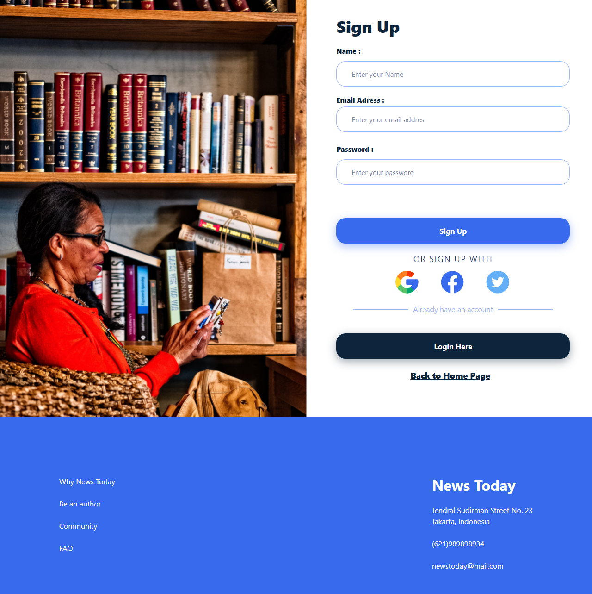

# News Today

News Today is a web application to read news around the world with various updated news categories. here users can also create news or articles after requesting to become an author. This is for API [News Today](https://github.com/yuliamassel/news_api) 

# Getting Started
    To running this app in local
      - Clone this repo with git clone https://github.com/yuliamassel/next-app.git  
      - npm install to install all reqruired dependencies
      - Create a .env  file 
      - node index.js or npm start to start the local server

  

# Equipment
    This project using with :

      - Next JS (Framework)
      - SWR & Axios
      - Bootstrap v5
      - React Bootstrap
      - React Icon
      - Socket Io

# Feature
- **Login**, if you already have an account.
- **Sign Up**, if you need to create an account.
- **Reset Password**, if you already have an account but forgot the password.
- **Home**, you can check & see many most popular news or articles and other activities in this app.
- **Article**, You can write you article if you make request to be author
- **Category**, you can looking at news with category 
- **My Article**, you can see the article that you created or post
- **Write Article**, you can write your articles
- **Profile**, you can customize or edit your profile.
- **Chat**, you can send message to your family or your friends
- **Notification**,  You can see your notification after making payment or chat

# Snippets

- Home

  
- Login

- Sign Up

- Articles  

